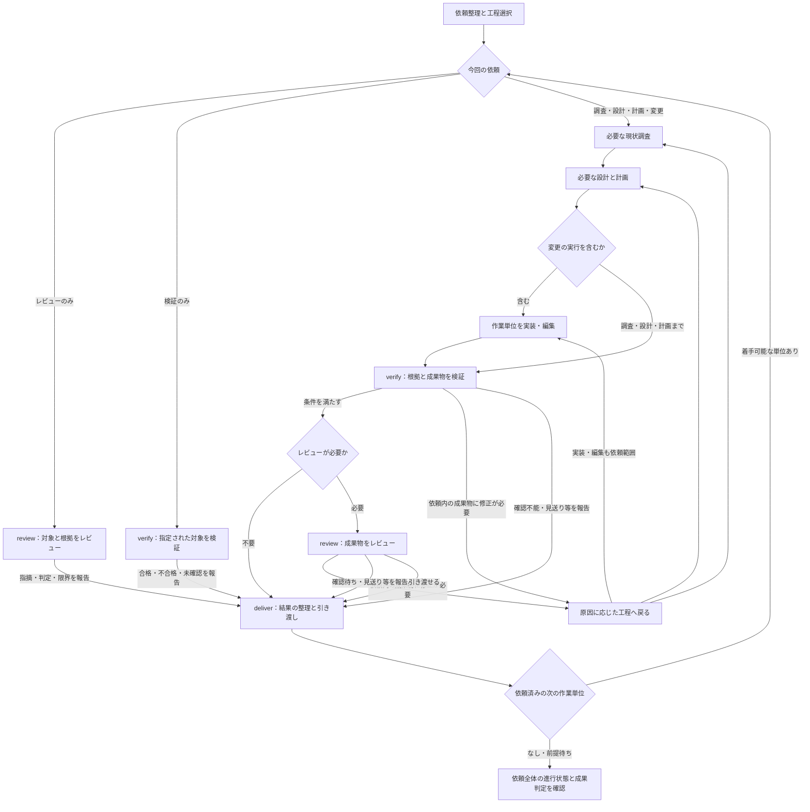

# 全体フロー

工程は仕事の種類、タスクは目的と完了条件を持つ実施単位として扱う。一つのタスクで必要な工程を選び、成果物と証拠を渡して進める。工程ごとのファイル作成や担当交代は必須ではない。

## 1. 依頼の終了地点を決める

依頼を受けたときや範囲を見直すときは [依頼整理](intake.md) を読み、目的・範囲・受け入れ条件・今回の成果物と終了地点を整理する。既存の決定は引き継ぎ、次の工程で決める詳細と、着手を妨げる未決事項を分ける。

調査で分かることは調べる。結果を左右する好みや方針が判断できない場合は確認し、その回答に依存しない作業を進める。依頼範囲内の作業は既存の承認で進め、同じ確認を繰り返さない。外部への送信、コミット、PR操作、マージ、公開等は、現在の依頼と権限の範囲で行う。

利用先のルール・原則は [use-principles](../../use-principles/SKILL.md) で確認する。利用先で参照を求められている資料を取得できない場合は、参照済みとせず、依存する判断と独立して進められる作業を分ける。フローを読むためだけにOKFを初期化しない。

| 依頼の種類 | 終了地点と工程の選び方 |
| --- | --- |
| 調査・説明 | 対象を調べ、根拠と説明を確認して回答する。修正を追加しない |
| 設計・計画のみ | 必要な調査から設計・計画を作り、整合性を確認して渡す。未決事項と実装未確認の範囲を残す |
| 機能追加・仕様変更 | 利用例と境界を決め、必要な単位を実装して実経路を検証する |
| 不具合修正・性能改善 | 再現・測定条件と基準値を残し、原因に対応する変更を同じ条件で確認する |
| リファクタリング・移行 | 保つ振る舞いと互換性を定め、移行単位と統合後の結果を検証する |
| 文書・スキルの変更 | 読者、適用条件、参照先を確認して編集する。形式の正しさと、内容・判断・動作の妥当性を分けて確認する |
| レビューのみ | 対象と根拠を確認して指摘を渡す。修正を追加しない |
| 検証のみ | 指定された対象を確認し、合格・不合格・未確認の結果と証拠を渡す。修正を追加しない |

読み取り専用の依頼では、タスク記録やOKFへの保存も行わない。回答の検証は根拠の照合で行い、説明のためだけに変更・実行を追加しない。

## 2. 規模とリスクから工程を選ぶ

| 規模 | 判断の目安 | 作業と記録の形 |
| --- | --- | --- |
| 小規模 | 一つの結果に収まり、方法がほぼ既知で、担当や依存する成果物を分ける必要がない | 同じ担当で進め、会話内で結果を残す。task.mdは新規作成しない |
| 標準（中規模） | 調査・設計の結果を次の工程へ渡す必要があり、複数の実装・検証単位を持つ | task.mdを入口にし、必要な設計・計画・検証資料を添える |
| 大規模 | 独立した成果物・担当範囲・納品単位が複数あり、依存関係と進捗の集約が必要 | 親子タスク、共通計画、状態と依存関係の台帳を持つ |

行数・ファイル数・経過時間だけで規模を決めない。親が大規模でも子は小規模でよい。途中で未知の影響や依存が見つかったら、選択と理由を更新する。

各工程を次のいずれかで扱い、選んだ理由を残す。小規模では「設計・計画は既知の方法として実装前の確認へ統合」のようにまとめてよい。

| 選択 | 扱い |
| --- | --- |
| 実施 | 成果物と終了条件を決め、独立した工程として行う |
| 統合 | 前後の工程と同じ担当・記録にまとめる。行った確認は残す |
| 再利用 | 既存成果物の対象・版・適合性を確認し、参照先と今回使える理由を残す |
| 省略 | 今回不要な条件と理由を残す。実施済みには数えない |

依頼整理、成果物に合う検証、結果の報告は短くても行う。現状調査は既存情報で十分なら適合性の確認へ縮める。設計・計画・独立レビューは次の条件で追加し、実装・公開は依頼範囲で選ぶ。

- 利用者の操作、公開API、永続データ、責務境界を変える場合は、設計で利用例・互換性・影響範囲を確認する。
- 新しい構造を決める、または既存の責務・データ所有・連携方式を組み替える場合は、[設計](design.md)で構造の異なる最低2案を独立に探索し、比較・統合する。工程を統合してもこの確認は行う。方法が既知の局所変更や適合する既存設計の再利用では、再探索を省く理由を残す。
- 観測で解消できる設計上の未知がある場合は、許可された範囲の小さな試作・計測で比較し、採否を記録する。
- 複数の作業単位がある場合は、順序・依存・担当・検証の区切りを計画する。
- 認証・権限、データ損失、戻しにくい移行に関わる場合は、失敗条件と復旧方法を設計し、対応する検証と独立レビューを行う。
- 設計の争点や大きな影響が残る場合、大規模作業の共通設計・統合箇所では独立レビューを行う。単純な子タスクへ一律に追加しない。

独立レビューや必要な観測手段を利用できない場合は、不足と代替証拠の限界を示す。自己確認を独立レビューと呼ばず、満たしていない条件を合格にしない。

## 3. 成果物を渡して進める

レビューのみはreview、検証のみはverifyへ直接進む。必要な対象理解や根拠の確認はその工程に含め、レビュー開始前の別工程として検証を必須にしない。調査回答・設計・計画の確認も、その作成工程へ統合してよい。

戻り先は、依頼された成果物について原因に関わる工程だけを選ぶ。設計・計画のみなら、その文書を見直し、依頼外のコード修正へ進まない。図中の複数の矢印は選択肢であり、同時実行の指示ではない。既存の成果物を再利用できれば、不要な作り直しを挟まず進める。

| 工程 | 入力と受け渡す成果物 | 次へ進む条件 |
| --- | --- | --- |
| [依頼整理 `intake`](intake.md) | 依頼と既存指示 → 目的・範囲・受け入れ条件・選択した工程 | 期待する結果と権限、依存する未解決事項が識別されている |
| [調査 `investigate`](investigate.md) | 対象と問い → 事実・根拠・再現手順・基準値・未確認事項 | 次の判断に必要な事実と限界が説明できる |
| [設計 `design`](design.md) | 要件と調査 → 構造の異なる候補・比較・統合理由、利用例と設計の骨組み | 必要な探索と統合案の確認が済み、実装を左右する未決事項が解消されている。設計のみなら不足を明示して渡せる |
| [計画 `plan`](plan.md) | 設計と完了条件 → 作業単位・担当範囲・依存、検証方法・期待値・必要な証拠と取得する対象・環境・時点、引き渡し条件 | 着手範囲の前提が成立し、循環依存や重複する書き込み担当がない。計画のみなら不足を明示して渡せる |
| [実装・編集 `implement`](implement.md) | 割り当て範囲と条件 → コード・設定・文書・必要なテストと差分 | 単位の検証に必要な変更がそろい、設計からの逸脱が説明できる |
| [検証 `verify`](verify.md) | 現在の成果物と受け入れ条件 → 方法・期待値・実測結果・証拠・判定 | 変更を先へ進める場合は必須条件が合格。検証のみなら不合格・未確認も区別して報告できる |
| [レビュー `review`](review.md) | 成果物・差分・理由・証拠 → 指摘と対応、見送り理由、残る条件 | 変更を先へ進める場合は必須の指摘が解消。レビューのみなら指摘と限界を渡せる |
| [引き渡し `deliver`](deliver.md) | 成果物・確認結果・判断 → 報告、確定した知識、依頼された納品操作 | 求められた終了地点へ到達し、成果物と証拠、知識の保存結果が対応する |

検証・レビューのみの依頼では、問題や確認不能を根拠付きで報告して終了できる。依頼された報告まで終えれば進行状態は完了にできるが、対象の不合格・未確認や要修正の判定は残す。報告の完了を対象の合格・承認・修正完了に置き換えず、依頼にない修正や公開へ進まない。必要な修正・検証の実施まで求められた依頼は、未達や確認待ちを報告しただけでは完了にしない。詳細は[状態と完了の判定](#状態と完了の判定)に従う。

実装は小さな単位で検証と往復する。不具合の局所テストが有効なら修正前の失敗を確認し、修正後に同じ経路を検証する。UI・CLIなど実物の確認が条件なら、利用可能な手段で実際の画面・操作・出力を確認する。必要な確認が通った後、理由なく検証範囲を広げたり同じ検証を繰り返したりしない。

実装中は採用した設計の利用例・境界・不変条件と照合する。同種の回避策や境界の逸脱が繰り返される場合は、[設計の見直し手順](design.md#失敗時の戻り先)へ戻す。設計の変更が必要な範囲と、それに依存する計画・検証を更新してから続ける。

レビュー前に不要な変更・重複・過剰な抽象化を整理する。指摘は再現性と影響を確認し、修正、理由付きの見送り、確認事項へ分ける。既存の他者の変更を戻さない。

## 4. 必要な専門スキルへ渡す

| 必要な仕事 | 接続先と渡す情報 |
| --- | --- |
| 原則・ルールを適用する | [use-principles](../../use-principles/SKILL.md)へ依頼・対象・段階を渡す。返された適用条件と未確認事項を工程選択へ反映する |
| 構成・実行時の流れを調べる | [how](../../how/SKILL.md)へ具体的な問い、対象と境界、既知の根拠を渡す |
| 採用理由や経緯を調べる | [why](../../why/SKILL.md)へ対象コード、既存の決定・履歴、知りたい理由を渡す |
| 現在の構成を文書化する | [system-blueprint](../../system-blueprint/SKILL.md)へ対象、確認済みの構成と根拠、既存文書を渡す |
| 知識を検索・保存する | [okf-agent-memory](../../okf-agent-memory/SKILL.md)へ対象bundleと問い、または整理した最終結果・判断・根拠を渡す |
| 再開用の記録を保存する | [checkpoint-safely](../../checkpoint-safely/SKILL.md)へ目的、現在状態、成果物・台帳への参照、次の操作、保存後に継続するかを渡す |

専門スキルの手順は接続先で読む。狭い問いが対象コードや既存の根拠の確認だけで解決する場合は、その場で調べ、how・whyを毎回起動しない。確認済みの知識と検索範囲は引き継ぎ、同じ調査を繰り返さない。調査結果の事実・推論・未確認の区別を保つ。

必要なスキル・道具が利用できなければ、利用可能な方法で進められる範囲と不足を明示する。未取得の根拠や未実施の専門作業を実施済みにしない。OKFとcheckpointの保存処理は、それぞれのスキルに任せる。

## 5. 記録を三つの役割で残す

### 作業中のタスク成果物

task.mdは標準（中規模）・大規模のタスクで作成する。会話中の小規模な依頼では新規作成せず、対象・完了条件・結果を会話に残す。既存タスクへの追加指示はその記録へ反映し、発言ごとに別タスクを作らない。作業が標準以上へ広がった時点で、確認済みの内容を引き継いでtask.mdを作成する。

同じタスクのtask.mdがあれば更新し、新規の既定は `.space/tasks/<task-id>/task.md` とする。既存Issue・設計資料は参照し、本文を複製しない。IDはIssue番号や作業名等から識別できるものを使い、別タスクと衝突しないことを確認する。

小規模でも意味のある判断・設計は、必要な設計資料に内容・理由・根拠・採用状況を残す。確定したシステムの知識は後述の条件でOKFへ整理する。引き継ぎは必要な資料とcheckpointで行い、保存のためだけにtask.mdを増やさない。読み取り専用・記録禁止の指定は優先する。

入口には、目的・範囲・受け入れ条件、工程の選択と理由、進行状態と成果判定、判断・結果・証拠への参照、残る作業を記す。短い内容は同じファイルにまとめる。別担当が使う、独立してレビューする、複数単位から共有する、詳細が多い場合にだけ次へ分ける。

| 内容 | 分割する場合の名前 |
| --- | --- |
| 依頼、調査、設計、計画 | `request.md`、`investigation.md`、`design.md`、`plan.md` |
| 作業の経過、判断の履歴 | `work-log.md`、`decisions.md` |
| 検証、レビュー、実行証拠 | `verification.md`、`review.md`、`evidence/` |

空の文書をそろえない。既存PR・CI・設計資料で内容を追える場合は参照する。工程を分けるためだけに本文を複製しない。

### 再開用のcheckpoint

中断・引き継ぎ・明示的な保存、コンテキストの縮約に備える場合はcheckpoint-safelyを使う。タスク成果物と台帳の要点・参照を渡し、返された保存先を記録する。工程が終わるたびの保存は求めない。

保存と中断を区別し、「保存して続けて」なら元の作業へ戻る。再開時はcheckpoint、参照するタスク成果物、差分や稼働処理などの実状態を照合し、必要な工程を選び直す。checkpointは保存時点の要約であり、進捗や成果物本文の正本にはしない。

### OKFに残すシステムの設計と歴史

依頼または独立して引き渡せる単位の終了時に、システムの設計・構成・変遷を理解するための内容を整理する。タスクは今回の目的・進捗・実施結果を持ち、OKFは対象システムの知識を持つ。完了タスクごとに結果文書を作らず、後の理解や判断に必要な事実・設計・出来事を選ぶ。OKFの既定bundleは利用先の `.space/babel/`。

既存知識の検索・参照は、調査・設計など必要な工程で行う。各工程は保存候補と根拠を渡し、実際の保存は原則として[引き渡し](deliver.md)が担当する。引き渡しで保存条件を判定し、OKFスキルを使って保存時の重複確認、作成・更新・関連付け、読み返しと形式検証を行う。

| 工程 | 引き渡す知識化候補・根拠 |
| --- | --- |
| investigate | 確定した事実・現在の構成、根拠と未確認の範囲 |
| design・plan | 採用した設計と理由、重要な代替案の採否、確定したシステム上の判断。作業順序・担当一覧はタスク側に保つ |
| implement | 実装した範囲、設計との差、未実装の範囲 |
| verify・review | 確認済みの結果、対象の版・証拠、残る問題と限界 |

候補は対象・内容・残す理由・根拠・確定度が分かるよう既存のタスク成果物に記し、専用ファイルを必須にしない。担当工程が分かれても同じ候補と根拠を引き継ぐ。

現在の構成文書そのものが依頼された成果物で、system-blueprintが専門手順内でOKFへ保存する場合は例外とする。引き渡しでは返された文書・対象の版・保存と検証の結果を確認し、同じ内容を重複保存しない。

| 残す内容 | 種類と新規保存先の目安 |
| --- | --- |
| 確認できた現在の仕様・構成 | `knowledge`。`knowledge/systems/<system>/`。構成文書はsystem-blueprintへ渡す |
| 重要な構成・仕様の変更、移行、障害・復旧等の確定した出来事と結果 | `knowledge`。`knowledge/systems/<system>/history/<event>.md` |
| 採用した設計の内容、採用・見送り・撤回の結論、理由、代替案、適用条件 | `decision`。`decisions/systems/<system>/<decision>.md` など対象に合う場所 |
| 確立した再利用可能な手順 | `procedure`。`procedures/` |

既存の同じ対象は元のconceptを更新・参照する。短く一体で理解できる内容は一つにまとめ、主な役割で種類を選ぶ。継続して適用すると決めたルール・原則だけを `rule`・`principle` にし、一度の経験を自動的に規則化しない。

設計記録は採用した構造・責務・境界と理由が分かる本文にし、タスク側の草案への参照だけで済ませない。採用状況と実装状況を分け、未実装・一部実装・実装確認済みのどこまで分かっているかを本文に記す。設計の採用だけで、現在の構成や実施済みの変更として記録しない。

歴史には、何がどう変わったか、いつ・どの版の出来事か、背景、確認できた結果と制約、関連する設計判断・証拠を残す。複数タスクによる一つの出来事は一つの履歴へ整理し、短い内容は既存の関連文書にまとめてよい。成功だけでなく、効果がなく戻した変更や見送りも、後のシステム理解や判断に必要なら残す。単にテストを実行した、ファイルを編集したという操作はタスク側に置く。

現在の仕様は更新し、過去の出来事・判断は当時の条件と後継への参照を保つ。現在の構成、関連する設計判断、重要な履歴をリンクし、同じ本文を複製しない。途中の案、毎回のテスト出力、TODO、会話全文、checkpointはそのまま登録しない。結論に必要な失敗条件・計測値は取り込む。OKFの `log.md` は文書操作の履歴であり、システムの歴史の代わりにしない。

知識本文だけでも結論を理解できるようにし、対象リビジョン・PR・保存した検証資料へつなぐ。一時ファイルの参照だけで根拠を済ませない。タスク記録から保存したconceptを参照し、元記録は自動削除しない。OKFの保存・検証に失敗した場合は未完了の操作と理由を残し、タスク側の記録を保持する。

## 6. 複数タスクを管理する

台帳で担当・依存・受け入れを追う場合は、[複数unitの管理](orchestrate.md)から[orch](../../orch/SKILL.md)へ渡す。台帳のコマンド・状態・再開・復旧はorchが定義する。unitは登録した作業の管理単位であり、一つのunitが必要な複数工程を通る。

親は全体の目的・受け入れ条件・共通設計・計画を持ち、子は担当範囲と検証条件を持つ。子は共通資料を参照し、全体の調査や設計を繰り返さない。最初の一単位を引き渡しまで通し、受け渡しや証拠の不足を直してから残りへ展開する。

タスク管理スキル・CLIが利用できる場合は、ID、親子関係、依存、担当、状態、成果物・証拠の参照を台帳で管理する。状態の正本を台帳にし、本文はタスク成果物を参照する。CLIがない場合は各タスクの記録を進捗の正本とし、親の計画には依存関係と子の記録への参照、確認時点の集約を置く。管理できる範囲で順次進め、利用できないコマンドを推測して実行しない。

担当を分ける場合は、環境で許可された手段で、独立した範囲だけを委譲する。目的、入力資料、所有ファイル、変更禁止範囲、依存、受け入れ条件、検証方法、報告先を渡す。同じファイルに複数の書き込み担当を置かず、他者の変更を戻さないよう伝える。特定の担当数やモデルを固定しない。

子を起動・再開するときは、タスクID、記録先または台帳の担当範囲、親への報告先、この資料の進捗更新ルールへの参照を渡す。小規模な子にもtask.mdを新規作成せず、CLIがなければ親の計画に担当範囲と報告結果を残す。参照先は子が読めるパスで伝え、自分で更新する範囲と親へ報告する範囲を明示する。

親は子の成果物と証拠を確認し、統合後の実物を全体の受け入れ条件と照合する。子の「完了」だけで全体を完了にしない。

## 7. 状態の変更と終了を扱う

### 進捗の更新者

記録ごとに進捗を更新する担当エージェントを一人決める。自分の記録・台帳を持つ子は、担当範囲の工程状態、検証結果、未決事項、次の操作を更新する。記録を持たない小規模な子は同じ情報を親へ報告し、親が自分の計画へ反映する。

| 担当 | 更新する内容 |
| --- | --- |
| 単独で進める担当 | 自分のタスクの進捗、成果物・証拠への参照、完了判定 |
| 子エージェント | 自分の担当範囲の進捗、成果物・証拠、完了または未完了の報告。兄弟タスクや親の集約は更新しない |
| 親・統括エージェント | 子の報告と証拠に対する受け入れ確認、依存関係、全体の集約と完了判定 |

子の作業完了と親の受け入れ確認は別に記録し、受け入れ確認は親が管理する記録へ置く。親は子の報告を未確認のまま全体の完了件数へ加えず、不足があれば指摘を返す。子はその結果を受けて、工程状態と次の操作を自分の記録または親への報告に反映する。親子が同じ進捗欄をそれぞれ書き換えない。

CLIを使う場合も各担当が自分のタスクの進捗を更新し、親は集約と受け入れ確認を担当する。共有台帳を直接編集せず、タスク管理スキルの更新・排他手順に従う。担当範囲の安全な更新ができない場合は、子が未反映の内容と理由を親へ報告して台帳更新を依頼する。親が保存できた範囲を確認するまで、台帳へ反映済みと扱わない。

CLIを使うタスクの本文には台帳への参照を置き、進捗の正本を二重に持たない。CLIを使わずtask.mdを持つ子は自分の記録を更新し、親はその参照と確認時点を付けて集約する。読み取り専用などで記録を書けない場合は、許可された報告経路で同じ情報を返す。

### 更新するタイミング

| 節目 | 担当が記録すること |
| --- | --- |
| 着手 | 担当、始める工程、現在の状態、次の操作 |
| 工程・検証可能な単位の終了 | 終えた内容、成果物と検証の結果・証拠、残る作業、次の工程 |
| 前提待ち・失敗の判明 | 進められない範囲、理由、不足する前提、再開条件、独立して進められる作業 |
| 再開・差し戻し・範囲変更 | 実状態と照合した現在の状態、見直す工程・条件、次の操作 |
| 中断・担当交代・タスク終了 | 保存できた最終状態、完了と未完了、証拠、必要な引き継ぎ先と次の操作 |

更新日時と、判断の根拠となる対象の版・差分・実行結果を残す。子は自分の記録があれば更新し、タスクID、現在状態、記録・証拠への参照、親の判断が必要な事項を報告する。親は報告を受けて確認・集約する。記録の更新に失敗した場合は保存済みとせず、その失敗も報告する。

すべてのコマンド実行ごとに更新せず、状態や次の判断が変わる節目で更新する。短い作業は複数の節目を一回の記録にまとめてよい。担当交代時は旧担当の書き込みが終わったことを確認し、担当と更新先を引き継ぐ。再開用の保存にはcheckpoint-safelyを使い、通常の進捗更新だけでcheckpointを作成しない。

### 状態と完了の判定

工程の選択、作業の進行状態、対象の成果判定を分ける。

| 記録 | 値と意味 |
| --- | --- |
| タスクの進行状態・工程の実行状態 | 未着手／実行中／判断・前提待ち／中断／完了／中止。完了はその依頼・工程の終了条件を満たしたこと、中止は取りやめが決まったこと |
| 成果判定 | 合格／不合格／未確認／対象外。条件を満たす証拠がある／満たさない結果を確認した／判定の証拠が足りない／条件が適用されない |

工程表では「実行状態」と「確認結果・参照」を別の欄にする。再利用では適合性を確認する作業の状態と、その結果を記す。省略した工程の実行状態は例外的に「対象外」と表示し、完了に数えない。適用される条件の検証を行えなかった場合は未確認であり、対象外や合格に変えない。

依頼を完了とする受け入れ条件と、検証・レビュー対象を評価する条件を区別する。例えば「一覧の検証結果と確認不能の理由を報告する」という依頼は報告後に完了とでき、対象版の並び順が不合格でもその判定を保つ。「不具合を直して検証する」という依頼は、必要な修正・検証が残る間は未完了とする。確認を途中で放棄したことを、報告完了として扱わない。

成果判定は対象・版・条件ごとに記録する。詳細はtask.mdの「条件ごとの結果」または既存のverification.md・review.mdに一度だけ置き、冒頭と工程表から参照する。不合格と未確認が混在する場合はそれぞれ残し、一つの合否で覆わない。レビューの「引き渡し可能・要修正・確認待ち」も評価した範囲とともに残す。合否を評価しない内容に判定を強制せず、指摘がないことだけで対象全体を合格にしない。

条件と検証結果を対応付け、標準以上では追跡できるID等と対象の版・差分・環境を残す。小規模も進行状態と判定を短く分けて伝え、既存の条件IDは保持する。条件を変更したら理由と影響する工程を残す。根拠の前提が変わった場合は過去の結果を保持し、影響する範囲の再確認を未着手・未確認として追う。無関係な工程まで繰り返さない。

必要な前提がなく進められない場合は、不足と再開条件を示す。依頼や確認できた根拠により失敗・見送り・取りやめとして終了が決まった場合は、その最終状態を整理して引き渡す。この経路で、満たしていない受け入れ条件を合格に変更しない。

完了を報告する前に、依頼全体の成果物と現在の証拠、残件、依頼された納品操作の結果を確認する。結果、判断理由、確認したこと、未確認の制約、成果物と知識への参照を短く伝える。保存しただけの記録や未実施の公開操作を、依頼全体の完了に置き換えない。
