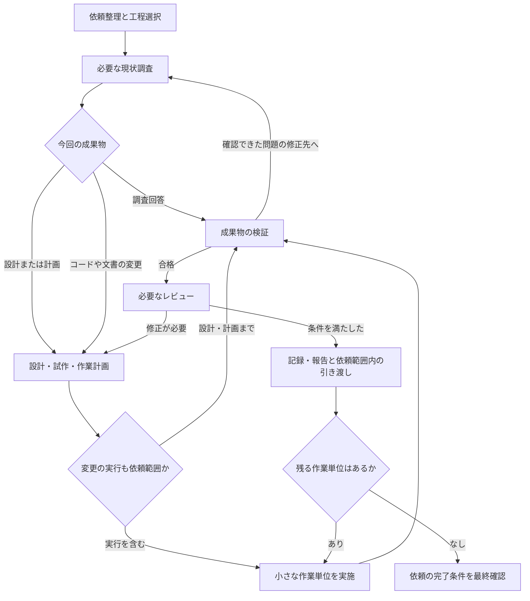

# 作業規模に応じた開発フローの設計案

2026-09-21。検討用の設計案。全体フローの定義場所、工程の責務、成果物、工程を選ぶ条件を扱う。CLIや配布用スキルはこの文書の作成によって実装済みにはならない。

目的は、依頼を受けたエージェントが、必要な工程と証拠を選び、途中で担当やセッションが変わっても作業を続けられるようにすること。作業が小さいときは工程を短くまとめ、大きいときは成果物と担当を分ける。

配置の前提は[プロジェクトの配布設計](architecture.md)。全体フローは統括スキルの `references/workflow.md` に同梱する案へ見直した。規模によらず判断・設計をなるべく残し、checkpointには既存のcheckpoint-safelyを使う。以下の新規スキル名、工程名、規模区分、成果物の分割方法は今回の提案であり、運用ルールとして適用する前にレビューする。

## 1. 定義を置く場所と責務

次のパスはagent-gearのリポジトリルートからの相対パス。新規案のファイルはまだ存在しない。全体フローと工程手順は配布されたスキル内の相対参照で読み、共通知識・ルールは利用先のBabelから読む。

| 定義 | 正本の配置 | 定義すること | 状態 |
| --- | --- | --- | --- |
| 全体フロー | `skills/development-workflow/references/workflow.md` | 工程の接続、依頼種別・規模・リスクによる選択、共通の完了条件、成果物の役割 | 新規案 |
| 全体フローの起動・進行 | `skills/development-workflow/SKILL.md` | 同梱の全体フローを読み、今回の工程を選び、担当へ渡し、結果から次の工程を選ぶ | 新規案 |
| 工程ごとの実行手順 | `skills/development-workflow/references/` | 各工程で入力をどう確認し、成果物をどう作り、終了をどう判断するか | 新規案。ファイル一覧は後述 |
| 工程成果物の記入ひな形 | `skills/development-workflow/assets/` | 独立した設計、計画、検証記録の記入枠 | 新規案。checkpointのひな形は同梱しない |
| 専門的な調査 | `skills/how/`、`skills/why/` | 現在の仕組みと設計理由を調べる具体的手順 | 既存。規模に応じた起動方法は調整対象 |
| 現在の構成の文書化 | `skills/system-blueprint/` | 確認できた現状をBabelの文書群へ整理する | 既存 |
| 原則・ルールの参照 | `skills/use-principles/` | 依頼と変更対象に適用する原則・ルールを選んで読む | 既存。フローの進行責務を分離する案 |
| タスク分割・状態管理 | `skills/task-management/SKILL.md` と `scripts/task.ts` | 作業単位、依存関係、担当、状態、証拠の参照を管理する | スキル名は仮称。CLIは未実装 |
| checkpointの作成・更新・保存 | `skills/checkpoint-safely/SKILL.md` と同スキル内の参照資料・ひな形 | checkpointの保存先・記録形式・保存手順を所有し、実状態と整合させる。中断も同スキルを使う | 既存。参照資料・ひな形の追加が必要になれば同スキル側で行う |
| この設計の説明と検証記録 | `docs/development-workflow-design.md` | 配置と責務の理由、検討中の選択、移行事項 | この文書。配布対象外 |

全体フローの本文は統括スキルの `references/workflow.md` を正本とする。`SKILL.md` やひな形へ工程選択の表を複製しない。工程ファイルは選択後の実行方法を持ち、規模による採否は `workflow.md` を参照する。how・whyの調査方法も工程ファイルへ転記しない。

この配置を選ぶ理由は、全体フローの変更責任が統括スキルにあり、工程手順と同じ版で配布・更新する必要があるため。複数工程から使うことだけでは、複数の独立したスキルに共通する知識とは判断しない。初期案のBabel配置では、フローを読むために利用先への文書配置とOKFを経由する依存も増えていた。スキルへの同梱により、その依存とコピーの版ずれを避ける。

一つの工程につき一つのスキルを増やす必要はない。まず統括スキルの参照ファイルとして実装し、単独で呼ぶ価値や独自のCLIがある責務だけを別スキルにする。統括スキルには共通トップレベルCLIを作らない。

配布物には統括スキルの `SKILL.md`、`references/`、`assets/` を同梱する。`SKILL.md` から `references/workflow.md` を読み、その後に必要な工程ファイルだけを読む。全体フローを利用先のBabelへコピーせず、読込にsetupやOKFを必要としない。原則・ルールの参照や知識の保存は、それぞれのスキルを通じてBabelを使う。開発リポジトリの絶対パスや、配布されない `docs/` を実行時の依存先にしない。

## 2. 工程と実施単位を分ける

**工程**は依頼整理、調査、設計などの仕事の種類。**タスク**は目的と完了条件を持つ実施単位。一つのタスクが複数工程を通る。工程ごとにタスクやエージェントを自動作成しない。

**成果物**は次の工程や利用者へ渡す結果。チャット、checkpointの節、独立文書、コード、実行証拠などがある。工程の実施と、独立したMarkdownファイルの作成を別々に判断する。

**規模**は主に管理する作業単位と依存関係の量を表す。**リスク**は検証やレビューの深さを決める。同じ1ファイルの変更でも、誤字修正と認証条件の変更では必要な確認が異なる。

## 3. 全体の進行

図の調査・設計・計画は、既に必要な情報がそろっていれば短く確認して先へ進める。検証失敗時は原因に応じて調査・設計・実装の該当工程へ戻り、毎回全工程をやり直さない。複数単位では各単位を検証し、最後に全体の完了条件を確認する。

中断・再開、原則の参照、判断の記録は必要な時点で行う横断的な処理。大規模作業の管理も工程を追加するものではなく、複数タスクをこのフローで進める管理方式である。

## 4. 規模・種類・リスクから工程を選ぶ

### 規模の初期判断

| 区分 | 判断の目安 | 管理の形 |
| --- | --- | --- |
| 小規模 | 一つの結果に収まり、方法がほぼ既知で、担当や依存する成果物を分ける必要がない | 同じ担当が続けて処理。判断・設計は短いcheckpointへ残す |
| 標準 | 調査結果や設計判断を次の工程へ渡す必要がある。複数の実装・検証単位があるが、一つの担当範囲として追える | タスクのcheckpointを入口にする。必要な設計・計画を添える |
| 大規模 | 複数の独立した成果物・担当範囲・納品単位を持ち、依存関係と進捗の集約が必要 | 親タスクと子タスクを分け、計画とCLIの台帳で管理する |

ファイル数、行数、経過時間だけで区分を決めない。大量の機械置換でも一つの道具と検証で完結する場合がある。途中で未知の影響や依存が見つかったら区分を見直し、追加する工程と理由を記録する。親が大規模でも子タスクは小規模でよい。

### 変更作業に対する基本構成

「短く」は工程をその場で実施し、独立文書を作らず記録を統合できること。「条件付き」は下の起動条件で選ぶこと。省略した工程を実施済みとして数えない。

| 工程・処理 | 小規模 | 標準 | 大規模 |
| --- | --- | --- | --- |
| 依頼整理 | 必須・短く | 必須 | 親で必須。子は割り当て内容を確認 |
| 現状調査 | 変更箇所と根拠を短く確認 | 影響する境界と経路を確認 | 親で境界を確認し、子へ必要な調査を分担 |
| 設計 | 条件付き。既知の方法なら短く | 条件付き。選択がある場合は理由を残す | 共通境界・互換性・作業間の受け渡しを設計。子の設計は条件付き |
| 試作・比較実験 | 未知の性質を観測する必要がある場合 | 同左 | 不確実性の高い共通部分から実施 |
| 作業計画 | 次の操作と確認方法を短く記す | 複数単位なら順序と区切りを記す | 依存関係、担当範囲、納品単位を文書化 |
| 実装・編集 | 依頼範囲に含まれる場合 | 同左 | 子タスクごとに実施 |
| 検証 | 必須。変更に合う最小の確認 | 必須。完了条件と結果を対応付ける | 子タスクの検証と統合後の検証 |
| レビュー | 差分・成果物の自己確認。独立レビューは条件付き | 設計上の選択・影響が大きい場合は独立レビュー | 共通設計・統合箇所を独立レビュー。単純な子の再確認を形式的に増やさない |
| 記録と報告 | 必須・短く。判断・設計があればファイル化 | 必須 | 子の結果を根拠付きで集約 |
| PR・マージ・公開 | 依頼・既存承認の範囲に含まれる場合 | 同左 | 同左。親と子の納品条件を先に分ける |
| タスク管理CLI | 原則不要 | 依存関係、担当、再開状態の管理が必要な場合 | 管理台帳として使用する目標 |

### 規模とは別に適用する条件

| 条件 | 追加・変更する工程 |
| --- | --- |
| 公開API、永続データ、責務境界、利用者の操作を変える | 設計で互換性と利用例を確認する。変更に対応する実経路を検証する |
| 認証・権限、データ損失、戻しにくい移行などの影響がある | 失敗条件と復旧を設計し、独立レビューと対応する検証を行う。既存承認があれば同じ承認は繰り返さない |
| 観測で決められる設計上の未知がある | 関連する部分だけ試作・計測し、採否を設計へ戻す |
| 複数担当が同じファイル・データを更新し得る | 所有範囲と順序を計画する。独立性を確保できる範囲だけ並行する |
| 設計、代替案の採否、原因に基づく修正方針、範囲・互換性・検証方法の重要な判断がある | 規模によらず、内容と理由、根拠をファイルへ残す |
| 中断・担当交代・別セッションでの継続がある | 規模によらず、再開可能なファイルと証拠の参照を残す |
| 調査で既存資料を再利用できる | 対象、基準時点、依頼との一致を確認して参照する。調査を実施したという記録に置き換えない |
| 必要な観測手段や独立レビュー担当を利用できない | 不足と代替証拠の限界を残す。満たしていない条件を合格にしない |

### 依頼の種類による終了位置

| 依頼 | 主な経路 | 完了時に渡すもの |
| --- | --- | --- |
| 調査・説明 | 依頼整理 → 調査 → 根拠と説明の確認 → 報告 | 根拠付きの回答、必要なら調査文書。実装やPRは追加しない |
| 設計のみ | 依頼整理 → 調査 → 設計 → 整合性確認・レビュー → 報告 | 将来案、代替案、リスク、未決事項。動作を検証したとは報告しない |
| 計画のみ | 依頼整理 → 必要な調査・設計 → 作業計画 → 計画の確認 → 報告 | 担当が実行できる計画と検証条件。実装を開始しない |
| 新機能・仕様変更 | 依頼整理 → 調査 → 必要な設計・計画 → 実装と検証 → レビュー・引き渡し | 変更と、要求を満たした証拠 |
| 不具合修正 | 依頼整理 → 再現と原因調査 → 必要な設計・計画 → 修正 → 同じ経路で再検証 | 原因、修正、修正前後の再現結果 |
| リファクタリング・移行 | 依頼整理 → 現状の振る舞いと利用箇所の確認 → 設計・計画 → 移行と検証 | 保った振る舞い、移行先、残存箇所の確認 |
| 文書・スキルの変更 | 依頼整理 → 読者・既存資料・適用条件の確認 → 必要な構成設計 → 編集・検証 | 文書と参照整合性。スキルでは代表的な依頼に対する工程選択も確認 |
| レビューのみ | 依頼整理 → 対象と根拠の確認 → レビュー → 報告 | 対象箇所・影響・根拠のある指摘。修正は追加しない |

読み取り専用という指定がある場合は、記録のための書き込みも追加しない。調査の保存や設計資料の作成が依頼されていれば、その成果物の書き込みを行う。設計の検討中に試作コードを書くかも、現在の依頼範囲で判断する。

## 5. 各工程の定義ファイル

以下の `references/` は `skills/development-workflow/references/` を指す。すべて新規案。専門スキルには具体的な方法を任せ、工程ファイルでは受け渡しと終了判断を定義する。

| 工程ID | 定義ファイル | 入力・主な作業 | 成果物 | 次へ進む条件 |
| --- | --- | --- | --- | --- |
| intake | `references/intake.md` | 元の依頼と既存の指示を読み、目的・範囲・完了条件・規模・実施工程を整理 | 依頼整理記録 | 期待する結果と許可範囲が分かり、依存する未解決事項が識別されている |
| investigate | `references/investigate.md` | 対象資料・コード・履歴から現状と影響を調べる。必要な問いをhow・whyへ渡す | 調査結果、再現手順、基準値、根拠 | 次の判断に必要な事実と、未確認の限界を説明できる |
| design | `references/design.md` | 利用例、入出力、データ、責務、境界を決める。必要な未知だけ試作する | 設計案、選択理由、試作の証拠 | 実装の形と制約が明確で、実装に依存する未決事項が解消されている。設計のみなら未決事項を明示して納品可 |
| plan | `references/plan.md` | 設計と完了条件を、検証可能な作業単位へ分ける。管理方法はtask-managementへ渡す | 作業計画、子タスクへの指示 | 各単位の範囲・依存・担当・証拠が定まり、循環依存や重複書き込みがない |
| implement | `references/implement.md` | 割り当て範囲を変更する。適切なテスト・スクリプトを用意し、選択した単位で実装と検証を繰り返す | コード・設定・文書・テスト・差分 | その単位を検証できる変更がそろい、範囲外の変更や設計からの逸脱が説明されている |
| verify | `references/verify.md` | 完了条件に対し、実経路や成果物を確認する。期待値と実際の結果を比べる | 検証記録、証拠、未検証事項 | 必須の確認が現在の成果物に対して合格。確認不能は合格と区別 |
| review | `references/review.md` | 成果物・差分・設計理由・検証証拠を読む。条件に応じて別の担当に確認を依頼 | 指摘、対応・見送り理由、残る条件 | 必須の指摘が解消され、残る制約が引き渡し条件と一致 |
| deliver | `references/deliver.md` | 求められた終了地点まで進め、結果と知識を整理。必要なPR・公開操作を行う | 完了報告、必要なPR、更新した知識文書、再開情報 | 依頼の納品条件と検証条件を満たし、残作業を完了と混同していない |

横断処理は `references/program.md` に大規模作業の開始・集約・終了を置く。checkpointの作成・更新・保存・中断はcheckpoint-safelyを使い、統括スキルに別の保存手順や再開メモのひな形を作らない。再開時は既存checkpointと実状態を入力に、`references/workflow.md` で再開する工程を選ぶ。programは同じ工程を子タスクに適用し、別の実装・検証手順を作らない。

各工程ファイルでは「目的／開始時に必要なもの／手順／成果物／終了条件／短縮・再利用・省略の扱い／失敗時の戻り先」を同じ順序で記述する。`references/workflow.md` が定める実施条件を追加・削除する場合は、先にその定義を変更する。

## 6. 成果物の内容と保存場所

### 保存の基本案

**判断や設計は、作業規模によらずなるべくファイルに残す。** ユーザーの希望を受け、意味のある選択が生じたときに保存する方式とする。設計案、代替案の採否、原因に基づく修正方針、互換性や対象範囲の判断、重要な検証方法の選択が対象。選んだ内容、理由、根拠、採用状況を短く残す。記録するのは説明可能な判断と証拠であり、内部の思考過程や会話全文ではない。

小規模でも、上の判断・設計があればcheckpoint-safelyへ短い記録の保存を渡す。新しい判断のない誤字修正や、単純な事実の確認はチャットの結果報告で足りる。標準以上、中断、引き継ぎ、後からのレビューが必要な仕事では、判断の有無によらずファイルへ保存する。読み取り専用・記録禁止の明示的な指定がある場合はそちらを優先し、回答内に判断を残す。

ファイル化する場合の入口は、[checkpoint-safely](../skills/checkpoint-safely/SKILL.md) が作成・更新して返すcheckpointのパス。同じタスクでは既存の記録を渡して更新を依頼する。保存先と記録形式をフロー側で再定義しない。現行スキルの既定名は `.space/checkpoint/<slug>-resume.md` であり、タスクIDと実際の保存先を対応付けて参照する。

独立した設計・計画・検証文書が必要になったときだけ、`.space/checkpoint/<task-id>/` に工程の成果物を分ける。この詳細ディレクトリは今回の追加案であり、checkpoint自体の保存形式ではない。各工程が成果物を作り、その要点と参照をcheckpoint-safelyへ渡す。文書の名前や文字数を埋めるために空のファイルを作らない。

### checkpoint-safelyへの受け渡し

全体フローは「いつ保存が必要か」と「今回保存する情報」を決め、checkpoint-safelyは保存を実施する。工程の完了、重要な判断・設計の更新、担当交代、中断・継続保存の依頼が受け渡しの契機になる。

渡す情報は、タスクID、既存checkpointへの参照、今回の依頼と制約、工程が作成した結果・判断・証拠への参照、現在の状態、次に必要な操作。継続中の保存か、中断の依頼かも伝える。記録項目の構成、保存方法、Gitへの保存条件をフロー側で複製しない。

checkpoint-safelyから実際の保存先と保存結果を受け取り、各工程やタスク台帳から参照する。保存だけを依頼した場合は保存結果を受けて作業を続け、中断を自動的に追加しない。呼出し時はユーザーの既存の指示と操作権限を引き継ぐ。

下表は各工程が作る内容とcheckpointへ渡す要点を定義する。checkpointの節名・テンプレート・保存手順を定義する表ではない。

| 成果物 | 最小限の内容 | 短い場合 | 独立させる場合の提案パス |
| --- | --- | --- | --- |
| 依頼整理記録 | 元の依頼への参照、目的、範囲、制約、受け入れ条件、終了地点、規模と理由、実施工程と省略理由、未解決事項 | チャット、または要点をcheckpoint-safelyへ渡す | `.space/checkpoint/<task-id>/request.md` |
| 調査記録 | 問い、対象・基準時点、確認した事実、根拠、再現・基準値、推論、未確認事項 | 回答本文、または要点をcheckpoint-safelyへ渡す | `.space/checkpoint/<task-id>/investigation.md` |
| 設計案 | 利用例、データ・型、責務・境界、処理の流れ、採用候補、代替案、互換性、リスク、未決事項 | 短くても内容と理由をcheckpoint-safelyへ渡す | `.space/checkpoint/<task-id>/design.md` |
| 作業計画 | 単位ごとの目的、成果物、許可範囲、担当、依存、検証条件、納品条件 | 要点をcheckpoint-safelyへ渡す | `.space/checkpoint/<task-id>/plan.md` |
| 子タスクの指示 | 親タスク、目的、入力資料、担当範囲、受け入れ条件、検証方法、報告先 | 子タスクの情報をcheckpoint-safelyへ渡す | 同スキルが返す子タスクのcheckpoint。briefという別文書は必須にしない |
| 検証記録 | 受け入れ条件ID、対象リビジョン、確認方法、期待値、実測結果、証拠、判定、未確認事項 | 短い結果報告、または要点をcheckpoint-safelyへ渡す | `.space/checkpoint/<task-id>/verification.md` |
| レビュー記録 | 対象リビジョン、確認範囲、指摘、根拠、対応・見送り理由、未解決条件、確認担当 | 要点をcheckpoint-safelyへ渡す。既存PRに記録があれば参照 | `.space/checkpoint/<task-id>/review.md` |
| 判断の履歴 | 日時、判断、理由、根拠、採用状況、結果。方針変更や重要な採否を記録 | 短くても内容と理由をcheckpoint-safelyへ渡す | `.space/checkpoint/<task-id>/decisions.md`。Markdownの表を初期案とする |
| 実行証拠 | 実行結果、画像、計測値など。対象と採取条件が分かるもの | コマンド結果への参照 | `.space/checkpoint/<task-id>/evidence/`。既存CI・PR等の証拠を利用できれば参照 |
| 完了・引き継ぎ報告 | 実現したこと、検証結果、残る事項、成果物への参照、必要なら次の操作 | チャットとcheckpointの現在の要約 | 独立した報告書は依頼された場合に作る |

文書を分ける条件は、別担当が参照する、独立してレビュー・更新する、複数単位から参照する、入口の要約だけでは判断できない詳細がある、のいずれか。標準タスクではcheckpoint一つで全工程を記録してもよい。大規模の親計画は独立文書とし、子タスクから共有する。

`assets/` に作るひな形の初期候補は `design-template.md`、`plan-template.md`、`verification-template.md`。checkpointのひな形は統括スキルに作らない。必要な記録項目やひな形を追加するときはcheckpoint-safely側で設計・実装する。工程のひな形も、独立文書として使う場面があるものだけ追加する。

### タスクの記録と長期的な知識

設計案は将来の提案として保存し、実装済みの構成を説明するblueprintへ混ぜない。構成・利用方法が変わった場合は、検証後に既存の資料を更新する。小さな変更ごとにシステム全体の文書を新規作成しない。

- 現在の構成を共有する必要があるときはsystem-blueprintを使い、既存の `.space/babel/knowledge/systems/<system>/` の文書を更新する。
- 将来の仕事にも必要な設計判断は、採用状況と根拠を確認して `.space/babel/decisions/systems/<system>/` などの既存の適切なconceptに記録する。仮説を合意済みの決定へ変えない。
- Babelの保存・更新はOKF CLIを通す。checkpointとその詳細ファイルはタスクの記録であり、Babelのconceptとして登録しない。
- 既存の同じ目的の資料が別の場所にあれば参照・更新し、標準パスへ合わせるためだけに複製・移動しない。

## 7. 工程の選択と実行状態を記録する

工程の選択は次の四つで残す。ひな形の空欄だけでは、省略と未実施を区別できないためである。

| 選択 | 意味 | 残すこと |
| --- | --- | --- |
| 実施 | 独立した工程として行う | 担当、成果物、終了条件 |
| 統合 | 作業は行うが、前後の工程と同じ担当・同じ記録へまとめる | 統合先と確認した内容 |
| 再利用 | 既存の成果物を確認して入力に使う | 参照先、基準時点、今回にも使える根拠 |
| 省略 | 今回はその工程が不要 | 条件と省略理由 |

実施・統合する工程の実行状態は「未着手／実行中／判断・前提待ち／完了」。再利用では適合性の確認が済んだかを記録する。タスク自体の「計画中／実行中／前提待ち／中断／完了／取りやめ」と分ける。具体的なCLIの列挙値は別途設計する。

ユーザーから新しい条件が来たときや、途中で影響範囲が広がったときは、依頼整理記録の変更点と影響する工程を更新する。受け入れ条件は安定したIDを付けて検証へ渡し、条件の撤回・変更を履歴なしで消さない。

検証結果は対象のコード・文書・環境を識別できる情報と結び付ける。根拠の前提が変わったら関係する検証とレビューを未完了へ戻す。無関係な工程まで繰り返さない。PRをマージする判定では、その時点の変更内容に証拠が対応することを確認する。

## 8. CLIへ渡す責務

CLIはフローを理解して意思決定する担当ではない。エージェントが選んだタスク構成と事実を保存し、集約する。文章の意味や実際の安全性を、ファイルがあるだけで合格判定しない。

| 管理対象 | フロー側で決めること | CLI側で保存・確認すること |
| --- | --- | --- |
| タスク | 目的、粒度、担当範囲、完了条件 | ID、親子関係、担当、状態、checkpointへの参照 |
| 依存関係 | 何がそろえば着手できるか | 依存先ID、前提状態、循環・参照切れ |
| 工程 | 実施・統合・再利用・省略の判断 | 選択、理由、実行状態、成果物参照 |
| 検証 | 必要な観測と期待値、結果の意味 | 対象、証拠、判定、担当、確認日時 |
| 判断待ち | 必要な問い、選択肢、影響する範囲 | 未解決・解決、決まった内容、根拠 |
| 進捗表示 | 利用者へ伝えるべき要点 | 台帳からの件数・状態・未解決事項の集計 |

CLIを使う場合、タスクID・状態・依存関係・担当の正本は台帳とする。台帳を確認した時点と現在状態をcheckpoint-safelyへ渡し、保存したcheckpointへの参照を台帳へ登録する。CLIはcheckpoint本文を直接作成・更新しない。目的や設計理由などの本文は成果物文書を参照する。

CLIを使わないタスクではcheckpointまたは会話内の記録が現在状態を持つ。途中からCLIへ移すときは同じタスクIDと成果物参照を登録し、その時点から状態の正本を台帳へ切り替える。元の判断や検証を作り直さない。

タスク台帳の物理的な配置、TSV・JSON等の形式、コマンド名、排他と復旧方式はCLIの設計で決める。成果物本文の保存場所とCLIの管理情報を分けておくことで、台帳形式が決まる前でも工程の試行はできる。現状ではtask CLIは未実装のため、大規模運用が動作するとは扱わない。

## 9. 大規模作業で増やすもの

親タスクは共通の目的、制約、全体の受け入れ条件、計画を持つ。子タスクは自分の担当範囲と検証だけを持ち、共通資料を参照する。各子が同じ全体調査・設計・計画を繰り返さない。

最初の一単位を、依頼整理から検証・引き渡しまで通す。担当範囲、受け入れ条件、証拠の保存方法に不足があれば、残りの単位へ展開する前に修正する。管理上の問題はフローへ、記録上の問題はCLIへ戻す。

統括担当は次に着手できる単位、依存先、共有ファイルの所有者、未解決条件を確認する。子タスクの担当数やモデル数を固定しない。利用環境と許可範囲に応じて、同じ担当による順次実行も選べる。

子の完了は親の完了ではない。親は統合後の実物と全体の受け入れ条件を確認する。納品がローカル変更までならその地点、PRまでならPR、マージまでならマージ後の必要な確認を終了地点とする。

## 10. 代表的な依頼で設計を確認する

以下は設計上の机上確認。実際のエージェントやCLIを動かした検証結果ではない。

| 依頼例 | 分類と工程 | 期待する成果物 | 防ぐべき過剰・不足 |
| --- | --- | --- | --- |
| READMEの誤字を直す | 小規模。依頼・調査・編集・確認・報告を短く実施 | 差分と確認結果 | 設計書、PR、CLI、テストを一律に追加しない |
| この関数が何をするか説明する | 小規模の調査。対象を読む → 説明を確認 → 回答 | コード参照付きの回答 | 記録のためだけに書き込まない。修正しない |
| 1行の認証条件を変える | 小規模でも高い影響。設計、対応する挙動の検証、独立レビューを追加 | 条件の理由、対象ケースの証拠、確認結果をファイル化 | 行数だけで工程を省かない |
| CLIにJSON出力を追加する | 標準。現状出力 → 出力形式の設計 → 実装・実コマンド検証 | checkpoint、必要な設計、既存出力とJSONの確認結果 | 変更していない出力の互換性を忘れない |
| 100箇所の同じ名前を置換する | 量が多くても既知の機械作業なら標準。一つの置換手段と全対象の検証を計画 | 変換手段、変更範囲、残存箇所と挙動の確認 | ファイル数だけで100人分の担当や設計書を作らない |
| 複数サービスのAPIを段階移行する | 大規模。共通設計・親計画 → 先行単位 → 子の実装と検証 → 統合確認 | 親計画、子のcheckpoint、台帳、互換性・統合の証拠 | 子の成功だけで全体を完了にしない |
| 複数サービスの構成を調べて文書化する | 範囲に応じて標準または大規模の調査。system-blueprintを使用 | Babelの構成文書と根拠 | 調査規模を理由に実装・マージ工程を追加しない |
| 設計案だけを作る | 調査・設計・設計の確認・報告で終了 | 将来案、代替案、リスク、未決事項 | 現在のblueprintを書き換えない。実装済みと報告しない |
| 小さなバグ修正を途中で引き継ぐ | 規模を変えず記録をファイル化。再現結果・差分・未実施検証を保存 | 同じtask-idのcheckpointと証拠 | 保存を成功判定にしない。保存だけなら勝手に中断しない |
| UI変更の検証環境を起動できない | 検証を前提待ちまたは未確認として記録 | 実施できた確認、不足、次の操作 | テスト成功で実画面の確認を代用したことにしない |
| 完了した設計資料を受け取って実装する | 設計は対象と版を確認して再利用 | 元資料への参照、実装・検証結果 | 承認済みの設計を理由なく再作成しない |

## 11. 現行からの移行と設計上の残り

まず全体フローと少数の代表工程を配布用ソースへ具体化し、小規模変更・調査のみ・標準変更で工程の選択と成果物を試す。CLIは、そこで使うタスク・依存・状態・証拠の項目が確かめられてから実装する。最後に親子タスクの先行一単位で大規模の管理を確認する。

実装時に接続を変更する対象は次のとおり。この設計資料の作成では変更しない。

- use-principlesの作業分類・進行・報告に関する本文を新しい統括側へ移し、原則参照の責務を残す。両方を同時に入口として起動しないよう、配布用の指示も接続する。
- howは現在、狭い問いでも説明担当を起動する。whyはGit履歴・PR・リポジトリ内資料を対象に、既定では調査担当1人と統合担当1人を使い、独立した調査範囲がある場合に並行化する。小規模の確認をこれらへ無条件に渡すと工程の短縮と矛盾するため、起動条件と直接確認する範囲を調整する。原文と同じ常時並行を前提にしない。
- checkpointは既存のcheckpoint-safelyへ集約する。現在の起動条件は明示的な保存・中断・引き継ぎ等なので、通常工程から継続保存を依頼する接続と、渡す情報の保持を同スキル側で確認する。必要な対応は同スキルへ追加し、全体フローに保存処理を持たせない。現行の既定名や既存記録をフロー側の都合だけで変更しない。
- `space/`・`packaging/` と配布生成は現状未整備。全体フローと工程手順がスキルに同梱され、相対参照で読めることを配布検証で確認する。Babelの共通知識・ルールの配置と参照は別に確認する。

レビューで詰める項目は、新規スキル名、独立レビューを必須にする変更条件の具体例、task CLIの保存形式である。工程の採否と成果物の内容はこの案で提示し、未確定のCLI形式を実装前提にしない。判断・設計を小規模でも保存する方針は、この案の前提として採用する。

## 12. 参照した既存資料

- [配布設計](architecture.md)。正本、スキル専用CLI、Babel、checkpointの配置に従った。
- [use-principles](../skills/use-principles/SKILL.md)。現在の作業分類・原則参照・検証・報告の責務を確認した。
- [how](../skills/how/SKILL.md)、[why](../skills/why/SKILL.md)。既存調査スキルの入力・出力と、起動方法の移行事項を確認した。
- [system-blueprintの文書モデル](../skills/system-blueprint/references/document-model.md)。現状の構成資料と判断記録の配置を継承した。
- [checkpoint-safely](../skills/checkpoint-safely/SKILL.md)。保存と中断の区別、既存記録の扱いを確認した。
- [pstackの入口](https://github.com/cursor/plugins/blob/032be146865d973682535de75f2287da438550bf/pstack/skills/poteto-mode/SKILL.md)。依頼の分類と専門手順への接続を参考にした。
- [pstackのFeature](https://github.com/cursor/plugins/blob/032be146865d973682535de75f2287da438550bf/pstack/skills/poteto-mode/playbooks/feature.md)。作業単位と検証の区切りを参考にした。
- [pstackのOrchestrate](https://github.com/cursor/plugins/blob/032be146865d973682535de75f2287da438550bf/pstack/skills/poteto-mode/playbooks/orchestrate.md)。大規模作業の管理、先行一単位、状態と証拠の記録を参考にした。専用CLI、モデル数、PR運用をそのまま移植する設計ではない。

リポジトリ内のスキルは開発対象として読んだ。この設計作業の運用指示として適用したものではない。
